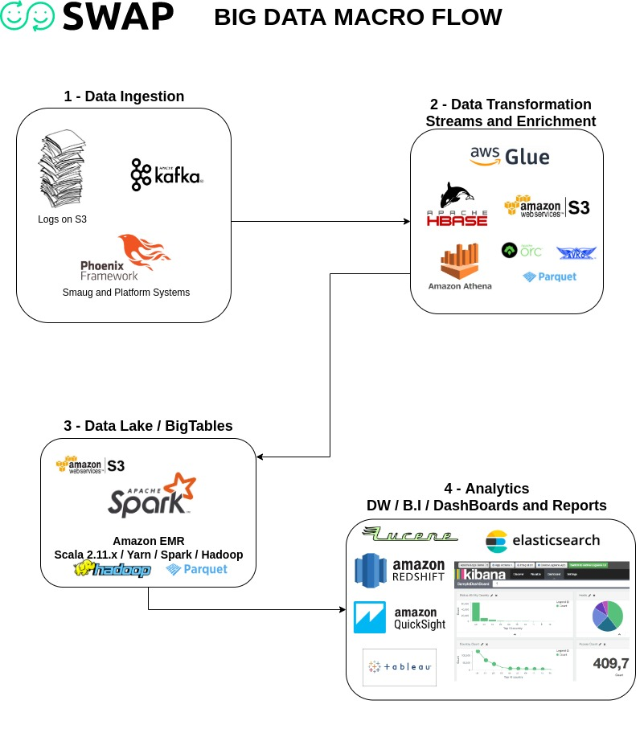
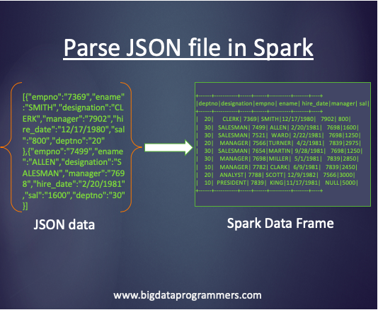

     

# Godzilla

Is the main project responsible for big data. 



# The first challenge to enrich data and insight experiments

One of the tasks of Data Engineering at Swap is to deal with the sheer amount of user behavior information and our partners systems.
All of this data is collected and stored for future analysis and continuous improvement of our services and products.

## Data

The Data we are using is being stored by bucket ingesters on AWS S3 and later enriched through Apache Spark and storage in HDFS with Parquet.

Example:
```
 {
    "_source": {
      "_host": "ip-172-31-3-XX",
      "_logtype": "customapp",
      "_mac": "0e:01:28:62:1f:73",
      "_tag": [
        "daenerys-staging"
      ],
      "_file": "/var/log/cloud-init-output.log",
      "_line": "05:25:56.754 application=webhooks module=Webhooks.Kafka.Consumer line=59 [info]  new message partner:XPTO_api body:%{\n  \"account\" => 764XXXX,\n  \"authorizationCode\" => \"00\",\n  \"currencyCode\" => \"986\",\n  \"date\" => \"2019-11-12T00:00:00\",\n  \"description\" => \"Comissao de Vendas Compra a Vista Pre-Pago Master\",\n  \"effect\" => \"Debit\",\n  \"eventId\" => 5266611,\n  \"merchantCategoryClassificationGroupId\" => 0,\n  \"overruledCode\" => \"\",\n  \"partnerId\" => 9,\n  \"type\" => \"Adjust\",\n  \"value\" => 0.08\n}",
      "_ts": 1573622757983,
      "_app": "cloud-init-output.log",
      "_multiline": true,
      "_ip": "172.31.3.XX",
      "_ipremote": "10.233.117.108",
      "level": null,
      "_lid": "1147657029335441415"
    }
  }
```

The total data set is divided and separated by year, month and day, where each day a batch of new records is generated.

The result of this processing is to get a large amount of data converted, indexed and transformed into HDFS file systems using the Parquet algorithm.

Preparing this pure and unstructured data into future enriched information ready to interact with more advanced analytical tools.



# Minimum requirements

Technology | Version
------- | --------
Linux | Amazon EMR 5.0
Scala | 2.11.x, 2.12 (Only on EMR 6.0 Beta)
Spark | 2.3.0
SBT   | 1.2.8

# Installation and Setup of the Scala environment 

I recommend installing the [SDKMAN](https://sdkman.io/) via CLI.

In Terminal, type:

```
$ curl -s "https://get.sdkman.io" | bash

$ source "$HOME/.sdkman/bin/sdkman-init.sh"

$ sdk version
```

After the installation, run the following commands:

```
#if you do not have Java8 installed (optional)
$ sdk install java

$ sdk install sbt

$ sdk install scala

$ sdk install spark
```

With the environment ready we will now run the program:

```
# Enter the root folder of the project where the build.sbt

$ sbt clean compile

$ sbt run
```

For unit testing, I used the ScalaTest and native BDD features in the Scala language. 

```
# Just execute:

$ sbt test
```

## Instructions to application setup and execution:

In "Resources" we have the configuration file [application.conf] with the following content:

```
Configuration {
    Enrichment {
        Json_SourceFolder="""/home/XXXXXXXXX/Project/Data""",
        Parquet_DestinationFolder="""/home/XXXXXXXXX/Project/Data/Enrichment"""
        Purge_DestinationFolder="""/home/XXXXXXXXX/Project/Data/Purge"""
    }
}
```

**It is VERY important that the above folders are pointed correctly on the machine in question.**

There is a Service that listens to the "Source Folder" and any new content that comes in will be automatically enriched in the "Parquet" format via Spark.

The first run may need extra time to be ready, as all data must be enriched and indexed. 

**Json_SourceFolder** - Source Folder where JSONs should be copied for processing.

**Parquet_DestinationFolder** - Destination folder where Parquet data will be created

**Purge_DestinationFolder** - Purge folder, where source data will be automatically copied after processing.

**This solution supports Amazon S3 repository**

## Rest Api's

**API to test if services are up**
```
http://localhost:9000/monitoring
```

